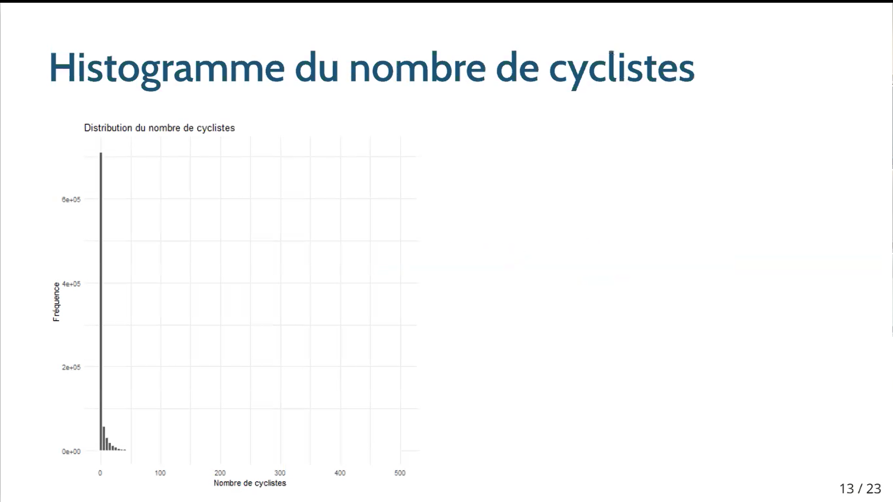
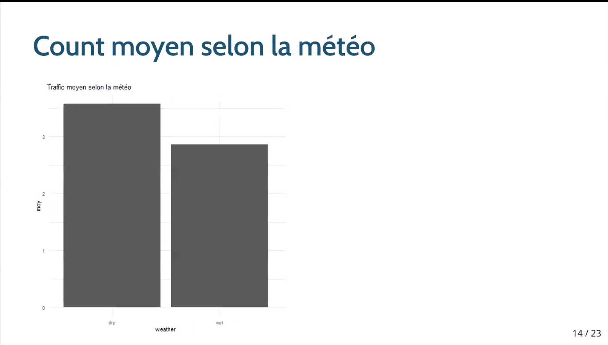
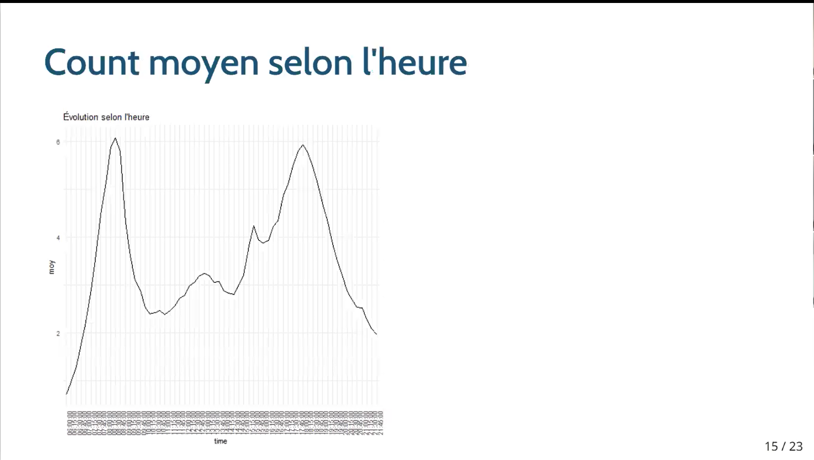

# 🚴 Analyse du trafic cycliste à Londres — Transport for London (TfL)


> Analyse complète des **patterns de mobilité cycliste à Londres** à partir du jeu de données public **Transport for London (TfL)** — 870 144 observations, printemps 2024.  
> Réalisé dans le cadre du cours **[8INF404 — Science des données et intelligence d'affaires](https://programmes.uqac.ca/8inf404)** — UQAC, Automne 2025.

---

## 📋 Table des matières

- [Question de recherche](#-question-de-recherche)
- [Données](#-données)
- [Méthodologie](#-méthodologie)
- [Résultats](#-résultats-principaux)
- [Visualisations](#-visualisations)
- [Structure du projet](#-structure-du-projet)
- [Reproduction](#-reproduction-de-lanalyse)

---

## 🔬 Question de recherche

> **Comment les facteurs temporels (heure, jour), contextuels (météo) et opérationnels (mode, direction) influencent-ils l'évolution du trafic cycliste moyen à Londres ?**

**Objectifs :**
- Identifier des tendances utiles pour la planification urbaine
- Appliquer le workflow complet de science des données : nettoyage → exploration → modélisation
- Utiliser des modèles de comptage (**Poisson / quasi-Poisson**) adaptés aux données de trafic

---

## 📦 Données

| Attribut | Valeur |
|---|---|
| Source | Transport for London (TfL) — données publiques |
| Période | Printemps 2024 (W1 spring) |
| Observations | **870 144 lignes** |
| Variables | **11 colonnes** |
| Intervalle | 15 minutes |

### Variables clés

| Variable | Description |
|---|---|
| `count` | Nombre de cyclistes comptés |
| `time` | Heure (64 niveaux de 15 min) |
| `day` | Jour de la semaine |
| `weather` | Conditions météo (dry / wet) |
| `mode` | Type de vélo (6 catégories) |
| `direction` | Direction (4 orientations) |

> ⚠️ Aucune donnée personnelle — uniquement des **comptages anonymes de trafic**.

---

## 🔧 Méthodologie

### Étape 1 — Nettoyage (`nettoyage_donnees.Rmd`)

- Normalisation des noms de colonnes (`clean_names`)
- Uniformisation des variables catégorielles (`day`, `weather`, `mode`, `direction`)
- Conversion des types (facteurs et entiers)
- Suppression des doublons et valeurs manquantes
- Export : `tfl_clean.csv` et `tfl_clean.rds`

### Étape 2 — Analyse exploratoire (`analyse_exploratoire.Rmd`)

Trois visualisations principales :

1. **Distribution du count** → asymétrie forte, présence de nombreux zéros
2. **Count moyen selon la météo** → trafic nettement plus élevé par temps sec
3. **Évolution horaire** → deux pics clairs : **7h–9h** et **16h–19h**

### Étape 3 — Modélisation (`modele_poisson.Rmd`)

Modèle ajusté :
```r
count ~ time + weather + mode + direction
```

Une **surdispersion élevée (≈ 17.6)** a conduit à utiliser un modèle **quasi-Poisson**.

---

## 📊 Résultats principaux

- **Pattern bimodal** du trafic : pic le matin (7h–9h) et pic le soir (16h–19h)
- Certains créneaux ont des **IRR > 6** (ex. 7h30–8h15)
- La météo **dry** est associée à une **hausse significative** du trafic cycliste
- Les **conventional cycles** présentent les volumes les plus élevés
- La direction **northbound** est la plus fréquentée

---

## 📸 Visualisations

**Distribution du nombre de cyclistes**


**Trafic moyen selon la météo**


**Évolution horaire du trafic cycliste**


---

## 📁 Structure du projet

```
projet-de-science-des-donnees/
├── nettoyage_donnees.Rmd         # Étape 1 — Nettoyage des données
├── analyse_exploratoire.Rmd      # Étape 2 — Visualisations exploratoires
├── modele_poisson.Rmd            # Étape 3 — Modèle quasi-Poisson
├── README.Rmd                    # Résumé exécutif
├── data/
│   ├── tfl_cycling_2024_spring.csv   # Données brutes TfL
│   └── README.md
├── docs/
│   └── figures/                  # Graphiques générés
│       ├── histogram_cyclists.png
│       ├── cyclists_weather_barplot.png
│       └── cyclists_by_hour.png
└── presentation/
    └── presentation.Rmd          # Présentation xaringan
```

---

## ▶️ Reproduction de l'analyse

### Prérequis

```r
install.packages(c("tidyverse", "janitor", "ggplot2", "knitr", "rmarkdown"))
```

### Exécution

```r
# Étape 1 — Nettoyage
rmarkdown::render("nettoyage_donnees.Rmd")

# Étape 2 — Analyse exploratoire
rmarkdown::render("analyse_exploratoire.Rmd")

# Étape 3 — Modélisation
rmarkdown::render("modele_poisson.Rmd")
```

---

## 👤 Auteur

**Salifou Diallo** — contribution principale : analyse exploratoire, visualisation et modélisation statistique  
Projet réalisé en équipe de 4 étudiants — UQAC, Automne 2025  
[](https://www.linkedin.com/in/salifou-diallo-3117702b2/)
[](https://github.com/SalifouDiallo)
